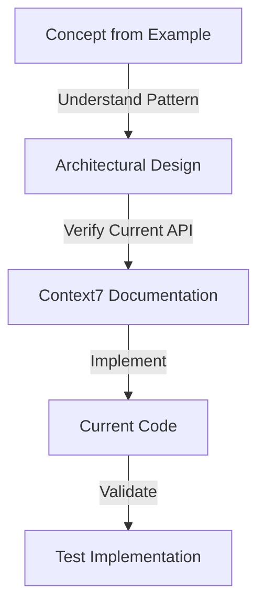

# LiveKit Concept Implementation Guide

**CRITICAL**: This guide explains how to use CONCEPTS from LiveKit examples while ensuring current API compliance through Context7.

## Core Philosophy

```
CONCEPT (from examples) + CURRENT API (from Context7) = SAFE IMPLEMENTATION
```

## When User Requests a Concept from Examples

### Step 1: Identify Concept Category

Determine which example contains the relevant concept:

```yaml
User Request → Concept Mapping:
  "Add voice commands" → ai_agent_patterns (livekit-agents)
  "Improve room connection" → frontend_patterns (meet example)
  "Add live captions" → real_time_processing (translation example)
  "Implement recording" → frontend_patterns (meet example)
```

### Step 2: Reference Concept, Not Code

#### ✅ CORRECT Approach:
```typescript
// User: "Implement token generation like in the examples"

// CORRECT: Reference the concept
// "The LiveKit Meet example uses an API route pattern for token generation.
// Let me verify the current implementation approach."

// Then verify with Context7:
const docs = await context7.getLibraryDocs({
  context7CompatibleLibraryID: '/livekit/livekit-server-sdk-js',
  topic: 'access token generation',
  tokens: 5000
});

// Implement using CURRENT API from Context7, following the PATTERN from example
```

#### ❌ WRONG Approach:
```typescript
// WRONG: Copying from example
// "Here's the code from the example:
// const token = new AccessToken(...)" // DON'T DO THIS!
```

### Step 3: Mandatory Verification Protocol

```typescript
// ALWAYS execute this verification before ANY implementation
async function verifyConceptImplementation(concept: string) {
  // 1. Check package.json for current version
  const packageJson = await read('package.json');
  const livekitVersion = packageJson.dependencies['livekit-client'];

  // 2. Get current documentation
  const docs = await context7.getLibraryDocs({
    context7CompatibleLibraryID: '/livekit/livekit-client',
    topic: concept,
    tokens: 5000
  });

  // 3. Verify the API exists and matches
  // 4. Check for deprecations
  // 5. Review current best practices

  return docs;
}
```

### Step 4: Implement Using Current APIs

Follow this implementation flow:



## Concept-Specific Implementation Guides

### Frontend Patterns (from Meet Example)

#### Room Connection Concept
```typescript
// CONCEPT: Server/client component separation
// VERIFICATION REQUIRED:
const docs = await context7.getLibraryDocs({
  context7CompatibleLibraryID: '/livekit/components-react',
  topic: 'room connection hooks',
  tokens: 5000
});

// IMPLEMENTATION APPROACH:
// 1. Follow the pattern of server component for params
// 2. Use client component for actual connection
// 3. Verify useRoom, useRoomContext hooks are current
// 4. Check if connection options have changed
```

#### Token Generation Concept
```typescript
// CONCEPT: API route with role-based permissions
// VERIFICATION REQUIRED:
const docs = await context7.getLibraryDocs({
  context7CompatibleLibraryID: '/livekit/livekit-server-sdk-js',
  topic: 'access token video grants',
  tokens: 5000
});

// IMPLEMENTATION APPROACH:
// 1. Understand role separation pattern
// 2. Verify current grant properties
// 3. Check metadata structure compatibility
// 4. Implement with current SDK methods
```

### AI Agent Patterns (from Python Examples)

#### Voice Agent Concept
```python
# CONCEPT: Worker-based agent deployment
# VERIFICATION REQUIRED:
docs = await context7.getLibraryDocs({
  'context7CompatibleLibraryID': '/livekit/agents-python',
  'topic': 'voice agent worker pattern',
  'tokens': 5000
})

# IMPLEMENTATION APPROACH:
# 1. Understand worker lifecycle
# 2. Verify current Python SDK patterns
# 3. Check event handler signatures
# 4. Implement with current agent framework
```

### Real-Time Processing (from Translation Example)

#### STT Forwarding Concept
```typescript
// CONCEPT: Transcription forwarding to all participants
// VERIFICATION REQUIRED:
const docs = await context7.getLibraryDocs({
  context7CompatibleLibraryID: '/livekit/livekit-client',
  topic: 'data channel transcription events',
  tokens: 5000
});

// IMPLEMENTATION APPROACH:
// 1. Understand forwarding architecture
// 2. Verify data channel API
// 3. Check transcription event structure
// 4. Implement with current event system
```

## Common Pitfalls to Avoid

### 1. Version Mismatch
```typescript
// ❌ WRONG: Assuming example uses same version
import { SomeAPI } from 'livekit-client'; // Might not exist!

// ✅ CORRECT: Verify version first
// Check package.json, then Context7 for current API
```

### 2. API Name Changes
```typescript
// ❌ WRONG: Using example's API names
room.on('participant-connected', ...); // Might be wrong event name!

// ✅ CORRECT: Verify current event names
// Check Context7 for current event: 'participantConnected' or 'participant-connected'
```

### 3. Deprecated Patterns
```typescript
// ❌ WRONG: Following old patterns blindly
// Example might use deprecated approach

// ✅ CORRECT: Check for modern alternatives
// Context7 will show current best practices
```

## Decision Tree for Concept Implementation

```
User requests feature
    ↓
Is it in our examples?
    ├─ Yes → Identify concept
    │   ↓
    │   Understand architectural pattern
    │   ↓
    │   Verify current API via Context7
    │   ↓
    │   Implement with current API
    │   ↓
    │   Test thoroughly
    │
    └─ No → Research via Context7
        ↓
        Design from scratch
        ↓
        Follow LiveKit best practices
```

## Integration with Our Project

### Our Classroom Features
When implementing concepts, always consider:
1. How does this interact with teacher/student roles?
2. Does it respect our permission model?
3. Will it work with our PreJoin flow?
4. Is it compatible with our UI customizations?

### Adaptation Checklist
- [ ] Concept identified from examples
- [ ] Current API verified via Context7
- [ ] Adapted for classroom mode
- [ ] Role permissions considered
- [ ] Edge cases handled
- [ ] Tests written
- [ ] Documentation updated

## Emergency Protocols

### When Context7 Fails
```typescript
// Fallback approach when Context7 is unavailable:
// 1. Check node_modules for TypeScript definitions
// 2. Use WebSearch for official LiveKit docs
// 3. Test cautiously in development
// 4. Document assumptions for later verification

// NEVER just copy from examples without verification
```

### When Concept Conflicts with Current API
```typescript
// If example pattern no longer valid:
// 1. Understand the intent behind the pattern
// 2. Find modern equivalent via Context7
// 3. Implement with new approach
// 4. Document the deviation

// The CONCEPT matters more than the specific implementation
```

## Summary

**Remember**: Examples provide INSPIRATION, Context7 provides IMPLEMENTATION.

1. **Examples** = What's possible (concepts, patterns, architecture)
2. **Context7** = How to do it today (current APIs, methods, best practices)
3. **Our Code** = Concepts + Current APIs + Our Requirements

Never skip the verification step. The examples are your map, but Context7 is your GPS.