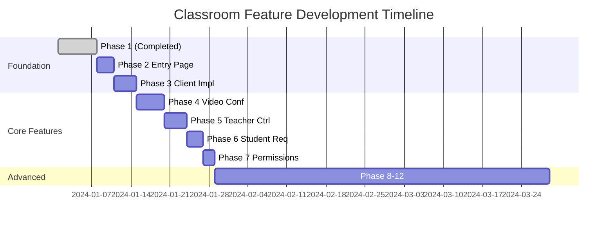

# LiveKit Meet Classroom Feature Roadmap

## 🎯 PHASE 5 COMPLETED - READY FOR PHASE 6

### Quick Start for Next Developer/Session

**Current Status**: Phases 1-5 complete (42% of total roadmap), ready to implement Phase 6 - Student Request Button

**Last Completed**: Phase 5 - Teacher Permission Controls with:
- ✅ Dynamic permission updates using LiveKit's updateParticipant API (Best Practice)
- ✅ No page reload/reconnection required - permissions update in real-time
- ✅ Portal-based dropdown menu to avoid UI overflow issues
- ✅ Native LiveKit speaking indicators (blue) for consistency
- ✅ Grant/Revoke speaking permissions for students
- ✅ Remove participant functionality fully working
- ✅ Agent/bot filtering from UI
- ✅ Students can enable camera/mic immediately after permission grant

**Phase 5 Achievement**: Full teacher control system using LiveKit's official updateParticipant API pattern, confirmed as best practice per LiveKit documentation. No token regeneration needed.

**Key Files to Enhance**:
1. Create `/app/rooms/[roomName]/ClassroomVideoConference.tsx` - Enhanced conference component
2. Refactor existing ClassroomClientImpl.tsx to use new component

**Architecture Decision**: Build specialized video conference component optimized for education use cases.

---

## 📊 Implementation Status

### ✅ Phase 1: Role-Based Token Generation (COMPLETED)

**Status**: Implemented and tested
**Documentation**: See `CLASSROOM_PHASE_1.md`

#### Completed Features:

- Role-based token generation (teacher/student)
- Smart PreJoin defaults based on role
- Permission model implementation
- Role indicator badges
- Graceful error handling for students
- Backward compatibility maintained
- Test utilities created

### ✅ Phase 2: Teacher-Shares-Link Flow (COMPLETED)

**Status**: Implemented and tested
**Documentation**: See `CLASSROOM_PHASE_2.md`

#### Completed Features:

- URL shortcut routes (`/s/` for students, `/t/` for teachers)
- Copy Student Link button for teachers
- Enhanced student PreJoin experience
- Optional PIN protection for classrooms
- Direct join flow via shared links
- Simplified classroom access

---

## 🚀 Next Implementation Phase

### ✅ Phase 3: Create Classroom Client Implementation (COMPLETED)

**Status**: Completed
**Priority**: High
**Documentation**: See `CLASSROOM_PHASE_3.md`

#### Completed Features:

- Built `ClassroomClientImpl.tsx` component with role-based layouts
- Implemented classroom-specific UI with teacher spotlight and student grid
- Added participant role management with visual badges
- Created optimized layout for one-to-many education scenarios
- Integrated proper LiveKit chat patterns with useLayoutContext
- Added translation feature for students (toggleable sidebar)
- Implemented role-based control bar (full controls for teachers, limited for students)
- Fixed all UI responsiveness and visibility issues
- Added smooth animations and transitions
- Ensured mobile responsiveness

---

### ✅ Phase 4: UI Enhancements & Bug Fixes (COMPLETED)

**Status**: Completed
**Priority**: High
**Documentation**: See `CLASSROOM_PHASE_4.md`

#### Completed Features:

- Fixed audio routing issue - teacher's microphone now works properly
- Resolved duplicate teacher section bug when enabling microphone
- Implemented speaking indicator for teacher using ParticipantTile
- Fixed chat message persistence when toggling visibility
- Added resizable translation sidebar with visual resize handle
- Implemented resizable chat sidebar with LiveKit-compliant approach
- Unified dark theme using LiveKit theme variables
- Fixed visual alignment between components
- All features maintain LiveKit component integrity

---

### ✅ Phase 5: Teacher Permission Controls (COMPLETED)

**Status**: Fully Completed - Production Ready
**Completion Date**: December 2024
**Actual Effort**: 2 days
**Implementation**: Using LiveKit updateParticipant API (Official Best Practice)

#### Objectives:

- Build `ClassroomVideoConference.tsx`
- Create education-optimized layout
- Implement focus mode for teacher
- Add classroom-specific controls

#### Layout Design:

```
┌─────────────────────────────────┐
│       Teacher Video (Large)      │
├─────────────┬──────────┬────────┤
│  Student 1  │ Student 2 │ Chat   │
│  (Small)    │ (Small)   │ Panel  │
└─────────────┴──────────┴────────┘
```

#### Key Features:

- Teacher spotlight mode
- Student grid view
- Minimize non-speakers
- Screen share priority
- Interactive whiteboard placeholder

---

#### Completed Features:

- ✅ Permission dropdown on student avatars (Portal-based for better UI)
- ✅ Grant/Revoke speaking permissions dynamically
- ✅ LiveKit updateParticipant API integration (no token regeneration)
- ✅ Real-time permission updates without page reload
- ✅ Student notification system for permission changes
- ✅ Remove participant from classroom functionality
- ✅ Native LiveKit speaking indicators (blue)
- ✅ Agent/bot filtering from student grid

#### Technical Implementation:

```typescript
// Using LiveKit's updateParticipant for dynamic permissions
await roomService.updateParticipant(
  roomName,
  studentIdentity,
  metadata, // Update role metadata
  { // Update permissions dynamically
    canPublish: action === 'grant',
    canPublishData: true,
    canSubscribe: true
  }
);
```

#### Key Files:
- `/lib/PermissionDropdownPortal.tsx` - Portal-based dropdown UI
- `/app/api/update-student-permission/route.ts` - Permission update API
- `/app/api/remove-participant/route.ts` - Remove student API

---

### 📓 Phase 6: Student Request System with Voice/Text Options

**Status**: Not Started → NEXT TO IMPLEMENT
**Priority**: High
**Estimated Effort**: 3-4 days

#### Objectives:

- Build dual-mode request system (voice and text questions)
- Implement floating raise hand button for students
- Add request mode selection modal
- Create visual indicators and question bubbles
- Build teacher request queue panel

#### Core Components:

1. **`StudentRequestButton.tsx`** - Floating button (like translation button)
2. **`RequestModeModal.tsx`** - Choose between voice/text mode
3. **`RequestIndicator.tsx`** - ✋ icon on student avatar
4. **`QuestionBubble.tsx`** - Floating text display for questions
5. **`TeacherRequestPanel.tsx`** - Queue management for teacher

#### User Flow:

**Student Side**:
1. Click floating raise hand button
2. Choose mode:
   - **Voice Mode**: Request to speak → Wait for approval → Join speaker grid
   - **Text Mode**: Type question → Submit → Question bubble ready
3. Visual indicator (✋) appears on avatar
4. For text: Question appears as bubble when clicked

**Teacher Side**:
1. See request in queue panel (with question text if applicable)
2. For voice: Grant speaking permission (Phase 5 integration)
3. For text: Read question, display to class, mark as answered
4. Auto-cleanup after handling

#### Key Features:

- ✅ Dual-mode request system (voice 🎤 or text 💬)
- ✅ Floating raise hand button for students
- ✅ Modal for request type selection
- ✅ Text input interface for written questions
- ✅ Visual indicators on avatars (✋ in top-left corner)
- ✅ Floating question bubbles for text questions
- ✅ Teacher queue panel with request management
- ✅ Integration with Phase 5 permission system
- ✅ Real-time updates via LiveKit Data Channels

#### Data Structure:

```typescript
interface StudentRequest {
  id: string;
  studentIdentity: string;
  studentName: string;
  type: 'voice' | 'text';
  question?: string; // For text requests
  timestamp: number;
  status: 'pending' | 'approved' | 'answered' | 'declined';
}
```

#### Integration Points:

- LiveKit Data Channels for real-time communication
- Phase 5 permission system for voice requests
- Existing student/teacher role detection
- Current UI layout and styling patterns

---

### 📔 Phase 7: ~~Create Permissions Update API~~ (OBSOLETE)

**Status**: Not Needed - Functionality implemented in Phase 5
**Note**: Phase 5's updateParticipant API already handles all permission updates
**Priority**: Skip - Consider removing from roadmap
**Original Estimate**: 2 days (saved)

#### Objectives:

- Build `/api/update-permissions/route.ts`
- Implement dynamic permission updates
- Add role switching capability
- Create audit logging

#### API Endpoints:

```typescript
POST /api/update-permissions
{
  roomName: string;
  participantId: string;
  permissions: {
    canPublish?: boolean;
    canPublishData?: boolean;
    canUpdateOwnMetadata?: boolean;
  };
  requestedBy: string; // Teacher ID
}
```

#### Security:

- Validate teacher permissions
- Rate limiting
- Audit trail
- WebSocket notifications

---

## 🎯 Advanced Features (Phase 8+)

### Phase 8: Interactive Learning Tools

**Timeline**: Q2 2025

- Polls and quizzes
- Collaborative whiteboard
- Screen annotation tools
- Breakout rooms
- File sharing

### Phase 9: Analytics & Reporting

**Timeline**: Q2 2025

- Attendance tracking
- Participation metrics
- Engagement analytics
- Session recordings with chapters
- Automated transcripts

### Phase 10: Translation & Accessibility

**Timeline**: Q3 2025

- Real-time transcription
- Multi-language translation
- Sign language support
- Screen reader optimization
- Keyboard navigation

### Phase 11: LMS Integration

**Timeline**: Q3 2025

- Google Classroom integration
- Canvas LMS support
- Microsoft Teams for Education
- Grade passthrough
- Assignment submission

### Phase 12: AI Teaching Assistant

**Timeline**: Q4 2025

- Automated Q&A
- Content summarization
- Study guide generation
- Intelligent tutoring
- Personalized learning paths

---

## 📅 Implementation Timeline



---

## 🎨 Design Principles

### User Experience

1. **Intuitive Role Selection**: Clear visual distinction
2. **Minimal Clicks**: Quick entry to classroom
3. **Progressive Disclosure**: Show controls as needed
4. **Responsive Design**: Works on all devices
5. **Accessibility First**: WCAG 2.1 AA compliance

### Technical Architecture

1. **Incremental Enhancement**: Each phase builds on previous
2. **Backward Compatibility**: Never break existing rooms
3. **Performance First**: Optimize for 30+ participants
4. **Scalable Design**: Support 100+ students per room
5. **Security by Default**: Validate all permissions server-side

---

## 🔧 Development Guidelines

### For Each Phase:

1. **Plan**: Create detailed technical specification
2. **Implement**: Follow existing code patterns
3. **Test**: Unit, integration, and E2E tests
4. **Document**: Update relevant documentation
5. **Review**: Code review and security audit
6. **Deploy**: Staged rollout with feature flags

### Quality Checklist:

- [ ] Maintains backward compatibility
- [ ] Includes error handling
- [ ] Has loading states
- [ ] Mobile responsive
- [ ] Keyboard accessible
- [ ] Performance tested
- [ ] Security reviewed
- [ ] Documentation updated

---

## 📊 Success Metrics

### Technical Metrics

- Page load time < 2s
- Time to join room < 5s
- CPU usage < 30% (30 participants)
- Memory usage < 500MB
- Network bandwidth < 2Mbps per student

### User Metrics

- Teacher setup time < 30s
- Student join time < 15s
- Feature adoption > 70%
- User satisfaction > 4.5/5
- Support tickets < 1%

---

## 🚧 Known Challenges

### Technical

1. **Dynamic Permissions**: LiveKit token updates require reconnection
2. **Scale Testing**: Need to test with 50+ participants
3. **Browser Compatibility**: Some features require modern browsers
4. **Mobile Experience**: Limited screen space for controls

### Product

1. **Role Authentication**: Need proper auth system
2. **Moderation Tools**: Handling disruptive participants
3. **Recording Storage**: Large files for long classes
4. **Network Quality**: Students may have poor connections

### Solutions Under Consideration

- WebSocket for real-time permission updates
- CDN for global distribution
- Adaptive bitrate for poor connections
- Progressive web app for mobile
- OAuth integration for authentication

---

## 📚 Resources

### Documentation

- [LiveKit Docs](https://docs.livekit.io/)
- [React Components Guide](https://docs.livekit.io/realtime/client/components/react/)
- [Server SDK Reference](https://docs.livekit.io/realtime/server/intro/)

### Design References

- [Google Meet for Education](https://edu.google.com/products/meet/)
- [Zoom Classroom](https://zoom.us/education)
- [MS Teams for Education](https://www.microsoft.com/en-us/education/products/teams)

### Community

- [LiveKit Slack](https://livekit.io/slack)
- [GitHub Discussions](https://github.com/livekit/livekit/discussions)
- [Stack Overflow](https://stackoverflow.com/questions/tagged/livekit)

---

_This roadmap is a living document and will be updated as development progresses._
_Last Updated: After Phase 5 Completion - Teacher Permission Controls with LiveKit updateParticipant API_
