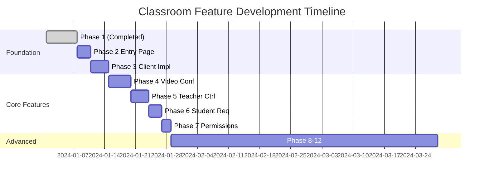

# LiveKit Meet Classroom Feature Roadmap

## 📊 Implementation Status

### ✅ Phase 1: Role-Based Token Generation (COMPLETED)

**Status**: Implemented and tested
**Documentation**: See `CLASSROOM_PHASE_1.md`

#### Completed Features:

- Role-based token generation (teacher/student)
- Smart PreJoin defaults based on role
- Permission model implementation
- Role indicator badges
- Graceful error handling for students
- Backward compatibility maintained
- Test utilities created

---

## 🚀 Future Phases

### 📘 Phase 2: Create Classroom Entry Page

**Status**: Not Started
**Priority**: High
**Estimated Effort**: 2-3 days

#### Objectives:

- Create dedicated `/classroom/[roomName]` route
- Build classroom-specific landing page
- Add role selection UI (teacher/student)
- Create classroom-themed PreJoin component

#### Implementation Plan:

```
app/
  classroom/
    [roomName]/
      page.tsx              # Main classroom page
      ClassroomPreJoin.tsx  # Custom PreJoin with role selection
```

#### Key Features:

- Visual role selection (cards or buttons)
- Classroom-specific instructions
- Waiting room for early students
- Teacher authentication placeholder

---

### 📗 Phase 3: Create Classroom Client Implementation

**Status**: Not Started
**Priority**: High
**Estimated Effort**: 3-4 days

#### Objectives:

- Build `ClassroomClientImpl.tsx` component
- Implement classroom-specific room logic
- Add participant role management
- Create optimized layout for education

#### Implementation Details:

```typescript
// ClassroomClientImpl.tsx
- Detect and store participant roles
- Configure room based on role
- Handle permission-based UI rendering
- Optimize for one-to-many communication
```

#### Key Features:

- Automatic layout switching (speaker/grid)
- Participant list with role indicators
- Connection quality indicators
- Classroom-specific notifications

---

### 📙 Phase 4: Create Custom Classroom Video Conference Component

**Status**: Not Started
**Priority**: Medium
**Estimated Effort**: 4-5 days

#### Objectives:

- Build `ClassroomVideoConference.tsx`
- Create education-optimized layout
- Implement focus mode for teacher
- Add classroom-specific controls

#### Layout Design:

```
┌─────────────────────────────────┐
│       Teacher Video (Large)      │
├─────────────┬──────────┬────────┤
│  Student 1  │ Student 2 │ Chat   │
│  (Small)    │ (Small)   │ Panel  │
└─────────────┴──────────┴────────┘
```

#### Key Features:

- Teacher spotlight mode
- Student grid view
- Minimize non-speakers
- Screen share priority
- Interactive whiteboard placeholder

---

### 📕 Phase 5: Create Teacher Controls Component

**Status**: Not Started
**Priority**: High
**Estimated Effort**: 3-4 days

#### Objectives:

- Build `TeacherControls.tsx` component
- Implement student management features
- Add classroom moderation tools
- Create quick actions panel

#### Control Features:

```typescript
interface TeacherControls {
  muteAllStudents(): void;
  grantSpeaking(studentId: string): void;
  revokeSpeaking(studentId: string): void;
  kickParticipant(participantId: string): void;
  lockRoom(): void;
  startRecording(): void;
  endClass(): void;
}
```

#### UI Components:

- Floating control panel
- Student list with actions
- Quick mute/unmute all
- Permission management modal
- Class session timer

---

### 📓 Phase 6: Create Student Request Button

**Status**: Not Started
**Priority**: Medium
**Estimated Effort**: 2-3 days

#### Objectives:

- Build `StudentRequestButton.tsx`
- Implement "raise hand" functionality
- Add request queue system
- Create notification system

#### Features:

- Animated raise hand button
- Request queue display
- Teacher notifications
- Auto-lower after speaking
- Request history

#### Data Flow:

```typescript
// Using LiveKit Data Channel
Student → RaiseHand → DataChannel → Teacher → Notification
Teacher → GrantPermission → API → Token Update → Student
```

---

### 📔 Phase 7: Create Permissions Update API

**Status**: Not Started
**Priority**: High
**Estimated Effort**: 2 days

#### Objectives:

- Build `/api/update-permissions/route.ts`
- Implement dynamic permission updates
- Add role switching capability
- Create audit logging

#### API Endpoints:

```typescript
POST /api/update-permissions
{
  roomName: string;
  participantId: string;
  permissions: {
    canPublish?: boolean;
    canPublishData?: boolean;
    canUpdateOwnMetadata?: boolean;
  };
  requestedBy: string; // Teacher ID
}
```

#### Security:

- Validate teacher permissions
- Rate limiting
- Audit trail
- WebSocket notifications

---

## 🎯 Advanced Features (Phase 8+)

### Phase 8: Interactive Learning Tools

**Timeline**: Q2 2025

- Polls and quizzes
- Collaborative whiteboard
- Screen annotation tools
- Breakout rooms
- File sharing

### Phase 9: Analytics & Reporting

**Timeline**: Q2 2025

- Attendance tracking
- Participation metrics
- Engagement analytics
- Session recordings with chapters
- Automated transcripts

### Phase 10: Translation & Accessibility

**Timeline**: Q3 2025

- Real-time transcription
- Multi-language translation
- Sign language support
- Screen reader optimization
- Keyboard navigation

### Phase 11: LMS Integration

**Timeline**: Q3 2025

- Google Classroom integration
- Canvas LMS support
- Microsoft Teams for Education
- Grade passthrough
- Assignment submission

### Phase 12: AI Teaching Assistant

**Timeline**: Q4 2025

- Automated Q&A
- Content summarization
- Study guide generation
- Intelligent tutoring
- Personalized learning paths

---

## 📅 Implementation Timeline



---

## 🎨 Design Principles

### User Experience

1. **Intuitive Role Selection**: Clear visual distinction
2. **Minimal Clicks**: Quick entry to classroom
3. **Progressive Disclosure**: Show controls as needed
4. **Responsive Design**: Works on all devices
5. **Accessibility First**: WCAG 2.1 AA compliance

### Technical Architecture

1. **Incremental Enhancement**: Each phase builds on previous
2. **Backward Compatibility**: Never break existing rooms
3. **Performance First**: Optimize for 30+ participants
4. **Scalable Design**: Support 100+ students per room
5. **Security by Default**: Validate all permissions server-side

---

## 🔧 Development Guidelines

### For Each Phase:

1. **Plan**: Create detailed technical specification
2. **Implement**: Follow existing code patterns
3. **Test**: Unit, integration, and E2E tests
4. **Document**: Update relevant documentation
5. **Review**: Code review and security audit
6. **Deploy**: Staged rollout with feature flags

### Quality Checklist:

- [ ] Maintains backward compatibility
- [ ] Includes error handling
- [ ] Has loading states
- [ ] Mobile responsive
- [ ] Keyboard accessible
- [ ] Performance tested
- [ ] Security reviewed
- [ ] Documentation updated

---

## 📊 Success Metrics

### Technical Metrics

- Page load time < 2s
- Time to join room < 5s
- CPU usage < 30% (30 participants)
- Memory usage < 500MB
- Network bandwidth < 2Mbps per student

### User Metrics

- Teacher setup time < 30s
- Student join time < 15s
- Feature adoption > 70%
- User satisfaction > 4.5/5
- Support tickets < 1%

---

## 🚧 Known Challenges

### Technical

1. **Dynamic Permissions**: LiveKit token updates require reconnection
2. **Scale Testing**: Need to test with 50+ participants
3. **Browser Compatibility**: Some features require modern browsers
4. **Mobile Experience**: Limited screen space for controls

### Product

1. **Role Authentication**: Need proper auth system
2. **Moderation Tools**: Handling disruptive participants
3. **Recording Storage**: Large files for long classes
4. **Network Quality**: Students may have poor connections

### Solutions Under Consideration

- WebSocket for real-time permission updates
- CDN for global distribution
- Adaptive bitrate for poor connections
- Progressive web app for mobile
- OAuth integration for authentication

---

## 📚 Resources

### Documentation

- [LiveKit Docs](https://docs.livekit.io/)
- [React Components Guide](https://docs.livekit.io/realtime/client/components/react/)
- [Server SDK Reference](https://docs.livekit.io/realtime/server/intro/)

### Design References

- [Google Meet for Education](https://edu.google.com/products/meet/)
- [Zoom Classroom](https://zoom.us/education)
- [MS Teams for Education](https://www.microsoft.com/en-us/education/products/teams)

### Community

- [LiveKit Slack](https://livekit.io/slack)
- [GitHub Discussions](https://github.com/livekit/livekit/discussions)
- [Stack Overflow](https://stackoverflow.com/questions/tagged/livekit)

---

_This roadmap is a living document and will be updated as development progresses._
_Last Updated: After Phase 1 Completion_
