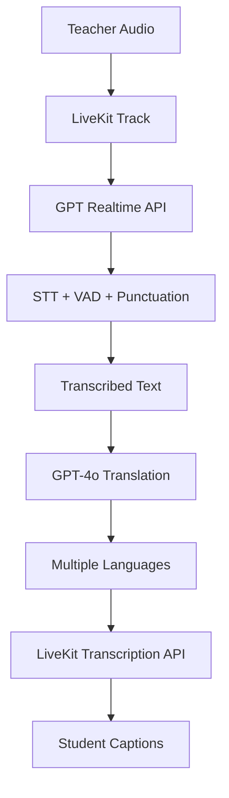

# LiveKit Translation Agent - Upgraded Architecture

## Overview

This document describes the upgraded translation agent that uses OpenAI's GPT Realtime API for Speech-to-Text with integrated Voice Activity Detection (VAD) and punctuation, and GPT-4o for high-quality translation.

## Key Improvements

### 1. GPT Realtime for Speech-to-Text

- **WebSocket Streaming**: Real-time audio processing with <1 second latency
- **Integrated VAD**: Server-side voice activity detection with semantic understanding
- **Automatic Punctuation**: Contextually-aware punctuation and capitalization
- **No External Dependencies**: Removed Silero VAD dependency

### 2. GPT-4o for Translation

- **Superior Quality**: More accurate and natural translations
- **Optimized Prompting**: Professional translator system prompts
- **Lower Temperature**: 0.3 for consistent, reliable translations
- **Smart Token Limits**: 500 tokens max for optimal performance

### 3. Performance Enhancements

- **Translation Caching**: Repeated phrases cached for instant delivery
- **Parallel Processing**: Simultaneous translation to multiple languages
- **Performance Monitoring**: Real-time metrics tracking
- **Error Recovery**: Graceful fallback with error indicators

### 4. Production Readiness

- **Comprehensive Logging**: Detailed logging with timestamps
- **Metrics API**: RPC endpoint for performance monitoring
- **Resource Management**: Proper cleanup and task management
- **Test Coverage**: Unit and integration tests included

## Architecture



## Installation

### Prerequisites

- Python 3.8+
- LiveKit Cloud account or self-hosted server
- OpenAI API key with GPT-4o and Realtime API access

### Setup

1. Install dependencies:

```bash
pip install -r requirements_upgraded.txt
```

2. Configure environment variables:

```env
# LiveKit Configuration
LIVEKIT_URL=wss://your-project.livekit.cloud
LIVEKIT_API_KEY=YOUR_API_KEY
LIVEKIT_API_SECRET=YOUR_API_SECRET

# OpenAI Configuration
OPENAI_API_KEY=YOUR_OPENAI_KEY
```

3. Run the upgraded agent:

```bash
python main_upgraded.py start
```

## API Endpoints

### Get Available Languages

```javascript
await room.localParticipant.performRpc({
  destinationIdentity: 'agent',
  method: 'get/languages',
  payload: '',
});
```

Response:

```json
[
  { "code": "es", "name": "Spanish", "flag": "🇪🇸" },
  { "code": "fr", "name": "French", "flag": "🇫🇷" },
  { "code": "de", "name": "German", "flag": "🇩🇪" },
  { "code": "ja", "name": "Japanese", "flag": "🇯🇵" },
  { "code": "ar", "name": "Arabic", "flag": "🇸🇦" },
  { "code": "zh", "name": "Chinese", "flag": "🇨🇳" },
  { "code": "pt", "name": "Portuguese", "flag": "🇵🇹" },
  { "code": "ru", "name": "Russian", "flag": "🇷🇺" },
  { "code": "ko", "name": "Korean", "flag": "🇰🇷" }
]
```

### Get Performance Metrics

```javascript
await room.localParticipant.performRpc({
  destinationIdentity: 'agent',
  method: 'get/metrics',
  payload: '',
});
```

Response:

```json
{
  "uptime_seconds": 3600,
  "total_success": 1250,
  "total_errors": 3,
  "error_rate": 0.0024,
  "avg_transcription_ms": 450,
  "max_transcription_ms": 890,
  "min_transcription_ms": 220,
  "avg_translation_ms": 180,
  "max_translation_ms": 420,
  "min_translation_ms": 95
}
```

## Performance Characteristics

### Latency Targets

- **Transcription**: 200-500ms (GPT Realtime)
- **Translation**: 100-300ms (GPT-4o)
- **End-to-End**: <1 second typical

### Resource Usage

- **Memory**: ~200MB baseline
- **CPU**: <10% during normal operation
- **Network**: Adaptive based on speech activity

### Scalability

- **Concurrent Rooms**: Limited by OpenAI API rate limits
- **Languages per Room**: 10+ simultaneous translations
- **Participants**: No hard limit (LiveKit handles scaling)

## Testing

### Run Unit Tests

```bash
python -m pytest test_upgraded_agent.py -v
```

### Run Integration Tests

```bash
python -m pytest test_upgraded_agent.py::TestIntegration -v
```

### Performance Benchmarking

```bash
python -m pytest test_upgraded_agent.py::PerformanceBenchmark -v
```

## Monitoring

### Log Levels

```python
# Set in main_upgraded.py or via environment
logging.basicConfig(level=logging.DEBUG)  # For debugging
logging.basicConfig(level=logging.INFO)   # For production
```

### Metrics Collection

The agent automatically logs performance metrics every 60 seconds:

```
2024-01-15 10:30:00 - Performance Metrics: {
  "uptime_seconds": 3600,
  "avg_transcription_ms": 450,
  "avg_translation_ms": 180,
  "error_rate": 0.0024
}
```

### Health Checks

Monitor the following for agent health:

- Error rate < 1%
- Average transcription latency < 1000ms
- Average translation latency < 500ms
- Memory usage < 500MB

## Troubleshooting

### Common Issues

#### High Latency

- **Cause**: Network congestion or OpenAI API throttling
- **Solution**: Check network connectivity and API rate limits

#### Translation Errors

- **Cause**: API quota exceeded or invalid API key
- **Solution**: Verify OpenAI API key and check usage dashboard

#### No Transcriptions

- **Cause**: Teacher audio not being received
- **Solution**: Verify teacher has microphone enabled and metadata contains role

#### Memory Growth

- **Cause**: Translation cache growing unbounded
- **Solution**: Cache is limited to 1000 entries by default

## Migration from Original Agent

### Breaking Changes

1. Removed `livekit-plugins-silero` dependency
2. Changed STT initialization (now uses Realtime API)
3. Updated LLM configuration for GPT-4o

### Migration Steps

1. Install new dependencies: `pip install -r requirements_upgraded.txt`
2. Replace `main.py` with `main_upgraded.py`
3. Ensure OpenAI API key has access to GPT-4o and Realtime API
4. Test in development environment before production deployment

## Security Considerations

- **API Keys**: Store in environment variables, never in code
- **Rate Limiting**: Implement client-side rate limiting if needed
- **Content Filtering**: Consider adding profanity filters if required
- **Access Control**: Validate teacher role from trusted metadata

## Cost Optimization

### OpenAI API Costs

- **GPT Realtime**: ~$0.06 per minute of audio
- **GPT-4o**: ~$0.015 per 1K input tokens, $0.06 per 1K output tokens
- **Estimated**: ~$0.10-0.15 per minute per active room

### Optimization Strategies

1. **Enable Caching**: Reduces repeated translation costs
2. **Batch Translations**: Process multiple segments together
3. **Language Detection**: Only translate to active languages
4. **Silence Detection**: Skip silent periods

## Future Enhancements

### Planned Features

1. **Multi-Teacher Support**: Handle multiple speakers
2. **Custom Terminology**: Industry-specific dictionaries
3. **Subtitle Export**: Save translations as SRT/VTT files
4. **Language Auto-Detection**: Detect teacher's language automatically
5. **Translation Quality Settings**: Balance speed vs accuracy

### Performance Improvements

1. **Local STT Fallback**: Use local models during outages
2. **Translation Pre-fetching**: Predict and cache common phrases
3. **WebSocket Reconnection**: Automatic reconnection on disconnects
4. **Load Balancing**: Distribute across multiple API keys

## Support

For issues or questions:

1. Check agent logs for detailed error messages
2. Verify all API keys and credentials
3. Test with the included test suite
4. Monitor performance metrics via RPC

## License

This implementation uses LiveKit and OpenAI APIs. Ensure compliance with both platforms' terms of service and usage policies.
